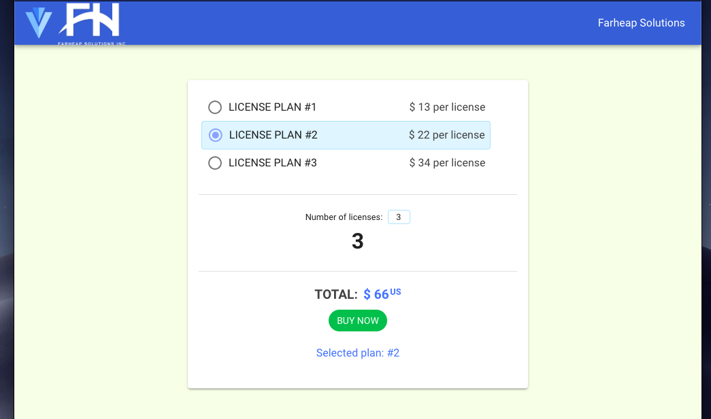

# Reactive Online Cart using Vue, Vuex, and Vuetify.

```sh
$ git clone https://github.com/webmasterdevlin/vue-cart.git
$ cd vue-cart
$ npm install
$ npm run serve
```

### Tasks

- Application should display selected Product and Total Price. (done)
- Products and available quantities should be loaded from separate JSON files. (done)
- “Buy now” button does not have any specific action. (done)

Go to http://localhost:8080


